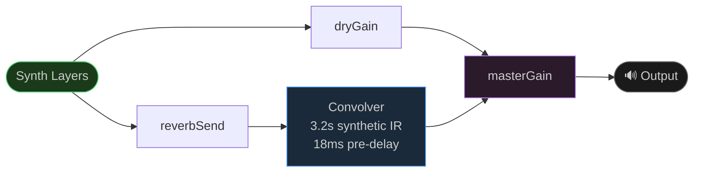
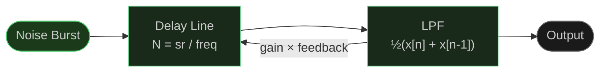
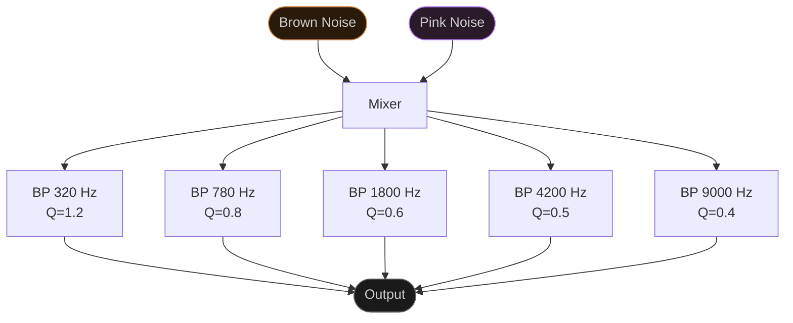
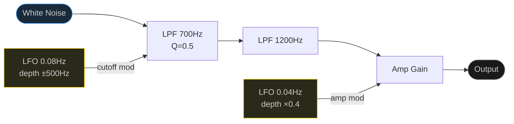
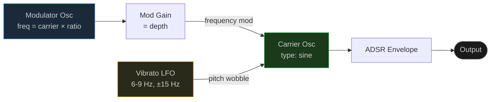
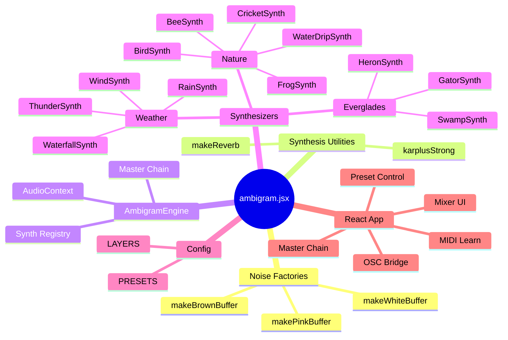
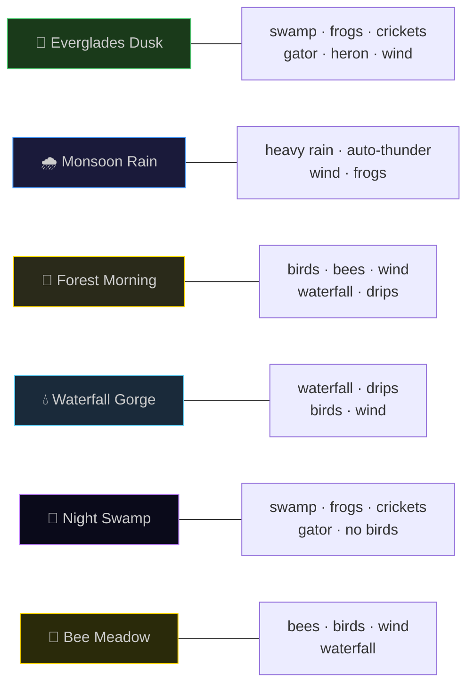

# Ambigram
Massive 64-Bit AI-driven Ambient Sound Generator *No samples. No loops. Every sound synthesized from first principles in real time.* The sound of a nature that doesn't exist.

---

## What Is This

Ambigram is a pure-synthesis ambient sound engine built on the Web Audio API. It uses **physical modeling**, **analog subtractive synthesis**, **FM synthesis**, **AM synthesis**, and **Karplus-Strong string/drip models** to generate evolving nature soundscapes entirely in the browser — no audio files, no prerecorded loops.

The goal: procedural, living sound that never repeats. Rain that varies in density and drop character. Frogs that call at organic intervals. A great blue heron that rasps across the swamp every few minutes. An alligator that bellows with infrasonic authority.

---

## Signal Chain

The reverb impulse response is synthesized — exponential noise decay with an 18ms pre-delay — no convolution files required. Reverb mix is continuously variable.

---

## Synthesis Techniques

### Physical Modeling

**Karplus-Strong Algorithm**
Used for rain drops and water drips. A noise burst seeds a feedback delay line with a low-pass averaging filter. Delay time sets pitch; the filter coefficient controls decay rate. Each drop gets a randomized frequency (200–3000 Hz).

**Resonator Banks (Waterfall)**
Five parallel bandpass filters tuned to the modal resonances of falling water (320, 780, 1800, 4200, 9000 Hz). Brown noise drives the low roar; pink noise adds upper-frequency spray.

**Alligator Infrasonic Model**
The American alligator's territorial bellow peaks below 30 Hz. Five sine oscillators at 22–88 Hz with exponential envelope swells, plus brown noise filtered below 120 Hz for the water-churn effect.

---

### Analog Subtractive Synthesis

**Wind**
White noise through two cascaded lowpass filters approximating a 4-pole Moog-style ladder. A slow LFO (0.08 Hz) sweeps the filter cutoff (±500 Hz) for gusts. A second amplitude LFO (0.04 Hz) produces swell and ebb.

**Bees**
Seven detuned sawtooth/square oscillators at ~220 Hz (±2% spread). Amplitude-modulated at 210–250 Hz to simulate wing-beat frequency. Filtered through a 1800 Hz lowpass.

**Crickets**
Three sine oscillators at 4600–5100 Hz, each amplitude-modulated by a sine LFO at ~14 Hz (chirp rate). Phase offset between voices produces natural beating.

**Swamp Drone**
Triangle/sine oscillators at 55, 82.4, 110, 164.8 Hz (harmonic series), each with a slow pitch-wobble LFO (0.03–0.07 Hz). Brown noise filtered below 180 Hz adds the subsurface mud rumble.

---

### FM Synthesis

**Birds (6 species)**
Carrier oscillator frequency-modulated by a second oscillator. Carrier-to-modulator ratio and depth define species character. A vibrato LFO (6–9 Hz) adds natural wavering.

| Species     | Carrier (Hz) | Mod Ratio | Mod Depth | Chirps |
|-------------|-------------|-----------|-----------|--------|
| Wren        | 3200        | 2.1       | 1800      | 8      |
| Warbler     | 2800        | 1.5       | 900       | 5      |
| Sparrow     | 2100        | 3.2       | 1200      | 12     |
| Cardinal    | 1600        | 1.0       | 600       | 3      |
| Mockingbird | 2400        | 1.8       | 1400      | 6      |
| Thrush      | 1900        | 2.5       | 1100      | 4      |

**Frogs (4 Everglades species)**
FM with species-specific parameters and repetition rates. Carrier frequency glides downward across call duration. A bandpass resonator at 70% of carrier adds vocal sac body resonance.

| Species         | Carrier | Mod Ratio | Reps | Character           |
|-----------------|---------|-----------|------|---------------------|
| Barking Treefrog| 600 Hz  | 3.5       | 2    | Sharp double-bark   |
| Bullfrog        | 420 Hz  | 2.0       | 1    | Deep falling bellow |
| Green Treefrog  | 850 Hz  | 4.2       | 5    | Rapid peeping       |
| Chorus Frog     | 1100 Hz | 5.0       | 8    | Fast trill          |

**Great Blue Heron**
Three-squawk call sequence, sawtooth FM at 280→180 Hz with a high-pass above 400 Hz to emphasize rasp. Random schedule every 8–20 minutes.

---

## Architecture

---

## MIDI And OSC Control

Ambigram now includes a dedicated **MIDI / OSC** control panel for live hardware control.

### MIDI

- Uses the **Web MIDI API** directly in the browser.
- Keeps the original default mappings:
  - `CC 1` or `CC 7` → master volume
  - `CC 11` → reverb mix
  - `CC 20–31` → layer levels
  - `CC 64` → thunder strike
  - `Note C3–B3` → layer toggles
  - `CC 70–81` → first parameter on each layer
- Adds **MIDI Learn** so any physical fader, knob, or button on your controller can be assigned to:
  - master volume
  - reverb mix
  - thunder strike
  - every layer level
- Learned bindings are saved in `localStorage`, so your fader box layout persists between sessions.

### OSC

- OSC is handled through a **WebSocket bridge** such as a local Node-based OSC relay.
- Default bridge URL: `ws://localhost:8080`
- Supported OSC addresses:
  - `/ambigram/master/volume f`
  - `/ambigram/master/reverb f`
  - `/ambigram/layer/<id> f`
  - `/ambigram/layer/<id>/on i`
  - `/ambigram/param/<id>/<paramId> f`
  - `/ambigram/thunder/strike i`

### Recommended Fader Box Workflow

1. Start Ambigram and open the `MIDI / OSC` panel.
2. Click `Enable MIDI`.
3. Press `Learn` beside the control you want.
4. Move the hardware fader or knob you want assigned.
5. Repeat for the layer strips you want on the box.

This makes it practical to dedicate a bank of physical faders to rain, waterfall, wind, birds, frogs, swamp, and the rest of the live mix.

---

## Synthesis Method by Layer

```mermaid
graph TD
    subgraph WX["🌦 Weather"]
        R["Rain\nPink noise + Karplus-Strong drops"]
        WF["Waterfall\n5-band resonator bank"]
        WD["Wind\nCascaded LPF + dual LFO"]
        TH["Thunder\nModal resonators + crack burst"]
    end

    subgraph NT["🌲 Nature"]
        BD["Birds\n6-species FM synthesis"]
        BE["Bees\n7-osc AM cluster"]
        CR["Crickets\n3-voice pulsed sine AM"]
        FR["Frogs\n4-species FM + resonator"]
        DR["Water Drips\nKarplus-Strong physical model"]
    end

    subgraph EV["🌿 Everglades"]
        SW["Swamp Drone\nHarmonic cluster + brown noise"]
        HE["Heron\nSawtooth FM rasp"]
        GA["Gator Rumble\nInfrasonic sine 22–88 Hz"]
    end

    WX --> SIG[Signal Chain]
    NT --> SIG
    EV --> SIG

    style WX fill:#0a1a2a,stroke:#4a9eff
    style NT fill:#0a1a0a,stroke:#4ecb71
    style EV fill:#0a1a10,stroke:#6bcf8a
    style SIG fill:#1a1a2a,stroke:#c084fc,color:#ccc
```

---

## Scene Presets

---

## Sound Layers

### Weather
| Layer     | Synthesis Method                                      |
|-----------|-------------------------------------------------------|
| Rain      | Pink noise (bandpass/shelf) + Karplus-Strong drops    |
| Waterfall | Brown + pink noise through 5-band resonator bank      |
| Wind      | White noise + cascaded LPF + dual LFO modulation      |
| Thunder   | Modal resonators on brown noise + crack transient     |

### Nature
| Layer       | Synthesis Method                                    |
|-------------|-----------------------------------------------------|
| Birds       | 6-species FM synthesis, stochastic scheduling       |
| Bees        | 7-voice detuned oscillator cluster, AM wing beats   |
| Crickets    | 3-voice sine AM at 14 Hz chirp rate                 |
| Frogs       | 4-species FM + resonator, pitch-glide envelope      |
| Water Drips | Karplus-Strong physical model, 200–1200 Hz          |

### Everglades
| Layer        | Synthesis Method                                   |
|--------------|----------------------------------------------------|
| Swamp Drone  | 5-osc harmonic cluster + brown noise undertone     |
| Heron        | Sawtooth FM rasp, 3-squawk sequence                |
| Gator Rumble | Infrasonic sine cluster (22–88 Hz) + brown noise   |

---

## Design Philosophy

**No samples.** Every sound is computed in real time from mathematical models of physical processes. The soundscape is theoretically infinite — it will never loop or repeat at a macro scale.

**Organic timing.** Creatures are triggered stochastically, not on metronome intervals. Call frequency scales with layer level, biasing toward realistic ecological densities.

**Analog character.** Subtractive synthesis layers use LFO modulation, filter sweeps, and oscillator detuning to avoid sterile digital perfection. The goal is hardware synthesis warmth applied to naturalistic sound design.

**Composability.** Every layer is independent with its own gain node and reverb send. The synthesis models are physically-grounded enough to coexist naturally in any combination.

---

## Extending the Engine

---

## Stack

- **React** (hooks) — UI state and rendering
- **Web Audio API** — all synthesis and signal routing
- **Zero external audio dependencies** — no Tone.js, no samples, no CDN audio

---

*Built for the Everglades and everywhere else that hums.*
